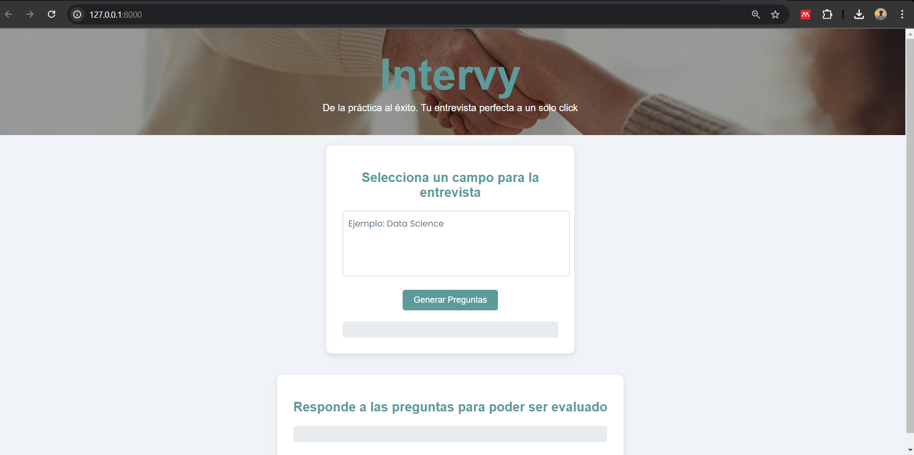

# Intervy - AI-Powered Interview Preparation

.

## Description
Intervy is a web application that helps users practice job interviews using artificial intelligence. Users can select a topic for their interview, receive ten related questions, and submit their answers for evaluation. The AI provides feedback to help users improve their responses and boost their confidence in real interviews.

This project has a Docker image available in the following Docker Hub repository, where you can download the image and run it locally for full usage, as the .env file is not included in this repository and the application cannot be executed without it: dangarpra/entervy_app. If you are very interested in using it, let me know so I can reactivate the database on AWS.

## Features
- Choose an interview topic.
- Receive ten automatically generated questions.
- Submit answers and get AI-driven feedback.
- User-friendly interface for smooth interaction.

## Technologies Used
- **Frontend**: HTML, CSS, JavaScript
- **Backend**: FastAPI
- **Database**: MySQL on AWS
- **AI Model**: Cohere API for question generation and answer evaluation

## Installation and Setup
1. Clone this repository:
   git clone [https://github.com/Danielgarpra/intervy.git ](https://github.com/Danielgarpra/Generative-AI.git)

2. Create a virtual environment :
    python -m venv env
    source env/bin/activate  # Windows: env\Scripts\activate

3. Install dependencies
- pip install -r requirements.txt

4. Start the FastAPI server (After decomment uvicorn.run(app))
- python app.py 

5. Access the application at http://127.0.0.1:8000.

## API Endpoints
- POST /generar_preguntas/: Generates 3 interview questions based on the selected topic.

- POST /evaluar_respuestas/: Evaluates the user's responses and provides AI feedback.

## License
This project is open-source under the MIT License.

